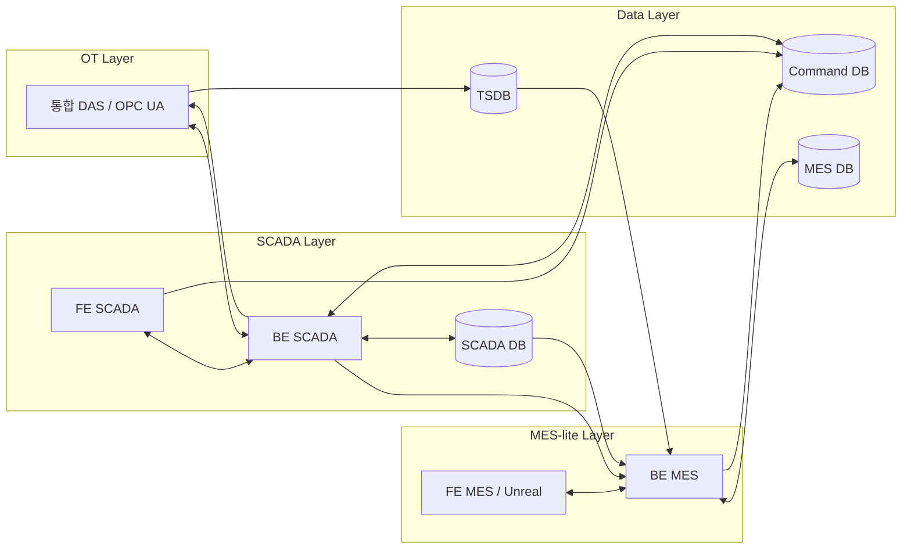

# Spring Boot 기반 SCADA + MES-lite + Unreal 디지털 트윈 개발 기획안

## 개요
본 기획안은 기존 SCADA 시스템 위에 MES-lite 기능을 추가하고, Unreal 기반 디지털 트윈 프런트엔드를 연계하는 방향으로 백엔드를 Spring Boot 기반으로 확장하는 개발 계획을 정리한 문서다. SCADA는 설비 실시간 수집과 제어를 담당하고, MES-lite는 작업 스케줄링과 디스패칭에 집중하며, Unreal은 3D 기반 운영 시각화 계층으로 활용하는 구조를 목표로 한다.[1][2][3]

핵심 원칙은 다음과 같다.[1][4]
- SCADA와 MES의 책임을 분리한다.
- 설비 제어는 SCADA 계층이 계속 담당한다.
- MES는 직접 OPC UA를 다루지 않고 명령/스케줄 중심으로 동작한다.
- Unreal은 MES 자체가 아니라 MES/SCADA 데이터를 시각화하는 디지털 트윈 프런트엔드로 둔다.[5][3]

## 시스템 구성도
다음 구조를 기준 아키텍처로 채택한다.[1][6]



### 구성 해석
- 통합 DAS는 OT 계층의 제어 및 원천 데이터 수집 허브이며, SCADA 백엔드와 OPC UA 또는 기존 연계 방식으로 연결된다.[7][8]
- SCADA는 설비 실시간 상태 조회, 운영 화면, 알람, 실제 제어 명령 실행을 담당한다.[1][9]
- TSDB는 고빈도 원천 시계열 저장소이며, MES-lite는 이를 직접 참고하거나 정제된 상태 데이터를 함께 활용해 스케줄링 판단을 수행한다.[10][11]
- Command DB는 MES와 SCADA가 공통으로 사용하는 명령 대기열 및 이력 중심 저장소로 사용된다.[12][13]
- Unreal 프런트엔드는 MES-lite 계층에 속한 디지털 트윈 UI로 보고, SCADA/MES 데이터를 시각화하는 역할에 집중한다.[3][5]

## 목표
이번 개발의 1차 목표는 다음과 같다.

- 기존 Spring Boot 기반 SCADA 백엔드를 유지하면서 제어 명령 파이프라인을 구조화한다.
- MES-lite 기능으로 작업 스케줄링, 설비 할당, 작업 시작/정지 요청 정도를 구현한다.[6][14]
- Unreal 프런트엔드에서 설비 상태, 작업 진행, 명령 결과를 실시간에 가깝게 시각화한다.[15][16]
- 모든 제어 명령을 DB 기반 queue와 history로 일관되게 관리하여 추적성과 재현성을 확보한다.[12][13]

## 범위
### 포함 범위
- 통합 DAS 연동 SCADA 제어 백엔드 확장
- 작업 스케줄링 중심의 MES-lite 기능
- 명령 큐 기반 제어 이력 관리
- Unreal 기반 디지털 트윈 프런트엔드 연동
- TSDB 기반 시계열 조회 및 상태 시각화 연계

### 제외 범위
- 정식 MES 수준의 lot 추적
- 품질 이력 및 genealogy
- ERP 연계
- 고급 배치/승인/전자서명 기능
- OT 영역의 프로토콜 구조 전체 교체

현재 단계의 MES는 정식 MES보다 생산 스케줄링/디스패칭 계층에 가깝고, ISA-95 관점에서 SCADA 상위의 Level 3 scheduling layer로 이해하는 것이 적절하다.[6][17][1]

## 시스템 방향
### 역할 분리
| 계층 | 주요 역할 |
|---|---|
| 통합 DAS | 설비/라인 제어, 원천 수집, OPC UA 서버/연동 처리 |
| BE(SCADA) | 설비 상태 조회, 제어 명령 실행, 알람/운영 데이터 처리 |
| DB(SCADA) | 운영 상태, 알람, 제어 로그 저장 |
| TSDB | 고빈도 raw 시계열 저장 |
| Command DB | 제어 명령 queue 및 command history 저장 |
| BE(MES) | 작업 스케줄링, 디스패칭, 설비 가용성 판단 |
| DB(MES) | 작업 계획, 명령, 스케줄, 상태 캐시 저장 |
| FE(MES, Unreal) | 3D 시각화, 작업 현황, 설비 상태, 작업 명령 UI |

MES와 디지털 트윈은 실시간 운영 가시성을 높이는 데 적합하며, MES 전체를 3D로 만드는 것보다 MES 데이터를 Unreal에서 시각화하는 방향이 더 현실적이다.[5][3][18]

## 핵심 아키텍처 결정
### 1. 제어는 SCADA가 책임진다
설비 제어의 최종 책임은 계속 SCADA 계층에 둔다. PLC/설비 제어는 여전히 OPC UA 또는 기존 OT 프로토콜을 통해 수행하며, 상위 MES가 직접 설비 제어 프로토콜을 다루지 않도록 한다.[7][9][8]

### 2. MES는 작업 명령을 생성하고 SCADA는 실행한다
MES-lite는 `어떤 설비에 어떤 작업을 언제 수행할지`를 결정하고, 실제 OPC UA 명령 전송은 SCADA worker가 수행하도록 분리한다. 이 방식은 MES가 직접 설비 태그/NodeId에 결합되는 것을 막고, 생산 스케줄링 레이어 역할에 집중하도록 돕는다.[4][19][6]

### 3. 명령 전달은 REST 직결보다 DB command queue 중심으로 간다
MES와 SCADA 사이 제어 전달은 직접 REST API 호출보다 DB command queue 기반으로 설계한다. DB 기반 queue는 영속성, 재시도, 상태 관리, 명령 이력 확보에 유리하며, 기간계/안정성 중심 환경에서 효과적인 패턴으로 설명된다.[12][13][20]

### 4. 모든 제어 명령은 하나의 파이프라인을 탄다
MES에서 내려온 명령뿐 아니라, SCADA 화면에서 직접 누른 명령도 동일하게 Command DB를 통해 처리한다. 이렇게 해야 모든 제어 행위가 단일 audit trail로 남고, 이력 누락 없이 재현 가능한 구조를 만들 수 있다.[21][13][22]

## 제어 명령 처리 방식
### 목표
- 모든 제어 명령의 단일 기록원 확보
- 명령 생성과 실행 결과의 분리
- 재시도/실패/완료 상태의 명시적 관리
- MES 및 SCADA 직접 제어 명령의 공통 경로화

### 처리 흐름
```text
1. FE(MES/Unreal) 또는 FE(SCADA)에서 제어 요청
2. BE(MES) 또는 BE(SCADA)가 Command DB(command_queue)에 명령 INSERT
3. SCADA BE 내부 Worker가 queue polling
4. Worker가 pending 명령을 processing으로 전이
5. OpcUaCommandExecutor가 통합 DAS에 OPC UA write 수행
6. 결과를 command_history 및 queue 상태에 반영
7. SCADA 상태/TSDB 변화가 FE(MES/Unreal)로 반영
```

DB queue 기반 worker 패턴은 백그라운드 실행과 사용자 요청 체인을 분리하는 전형적인 구조이며, 장기 실행 작업과 외부 side effect 처리에 적합하다.[23][24] OPC UA 측에서는 SCADA BE worker가 OPC UA client/controller 역할을 맡는 것이 자연스럽다.[8][25]

### 상태 전이
권장 상태 전이는 다음과 같다.[12][26]

- `PENDING`
- `PROCESSING`
- `COMPLETED`
- `FAILED`
- `CANCELLED` (선택)
- `TIMEOUT` (선택)

동시 worker 환경에서는 `FOR UPDATE SKIP LOCKED` 같은 방식으로 중복 실행을 방지하는 것이 일반적으로 권장된다.[20][27][26]

## DB 설계 방향
### command_queue
운영 중인 명령을 관리하는 테이블이다.[12]

권장 컬럼 예시:
- `id`
- `source_type` (`MES`, `SCADA`)
- `machine_id`
- `line_id`
- `command_type`
- `payload_json`
- `status`
- `priority`
- `retry_count`
- `max_retry`
- `created_by`
- `created_at`
- `picked_at`
- `finished_at`
- `idempotency_key`
- `last_error_message`

### command_history
상태 전이와 실행 결과를 append-only로 보관하는 이력 테이블이다. audit trail은 시간순으로 누가 무엇을 언제 바꿨는지 남기는 구조가 중요하며, history/shadow table 패턴이 일반적이다.[13][28][29]

권장 컬럼 예시:
- `history_id`
- `command_id`
- `old_status`
- `new_status`
- `changed_at`
- `changed_by`
- `worker_id`
- `message`
- `process_index`

### 설계 원칙
- queue는 현재 처리 대상 관리
- history는 불변 이력 저장
- process counter는 보조 지표로만 사용
- 제어 이력의 본체는 command row와 history row가 담당

## Spring Boot 구현 방향
### 새 모듈: control
기존 SCADA 백엔드가 `alarm`, `analysis`, `equipment`, `line`, `operation`, `sensor` 등 feature 중심 패키지 구조를 가지고 있다면, 제어 명령 기능은 `writeEquipCommand` 같은 클래스명보다 **`control`이라는 feature module**로 분리하는 것이 적합하다.[30][31]

권장 패키지 예시는 다음과 같다.

```text
com.example.phm.control
 ├─ controller
 │   └─ ControlCommandController
 ├─ application
 │   ├─ ControlCommandService
 │   ├─ ControlCommandWorker
 │   └─ ControlCommandDispatcher
 ├─ domain
 │   ├─ ControlCommand
 │   ├─ CommandStatus
 │   └─ MachineCommandType
 ├─ infrastructure
 │   ├─ CommandQueueRepository
 │   ├─ CommandHistoryRepository
 │   └─ OpcUaCommandExecutor
 └─ dto
     ├─ CreateControlCommandRequest
     └─ ControlCommandResponse
```

package-by-feature 구조는 관련 코드를 하나의 기능 단위 아래에 모아 이해성과 유지보수성을 높이는 방식으로 자주 권장된다.[30][32][31]

### Controller
기존 `@PostMapping("/api/analysis-results")`와 동일한 방식으로 `control.controller`에 HTTP 진입점을 두면 된다. Spring MVC에서 `@PostMapping`, `@GetMapping`은 REST controller의 요청 처리 메서드에 사용된다.[33][34]

예시 경로:
- `POST /api/control-commands`
- `GET /api/control-commands/{id}`
- `GET /api/control-commands?status=PENDING`

Controller는 얇게 유지하고 실제 로직은 service/application 계층으로 위임하는 것이 좋다.[35][36]

### Worker
SCADA BE 내부에 worker를 두어 queue를 polling하고 OPC UA write를 수행한다. polling consumer는 Spring Integration에서도 제공하는 일반적인 패턴이며, dedicated worker queue는 순차 처리와 백그라운드 실행에 적합하다.[37][38]

최소 worker 기능은 다음과 같다.[27][26]
- pending 조회
- processing 상태 전이
- OPC UA write 수행
- 성공 시 completed 처리
- 실패 시 failed 처리
- retry 및 timeout 관리
- 같은 설비 단위 직렬 처리

### OPC UA 설정
현재 `application-local.yml`의 `phm.opcua.x-das` 설정은 X-DAS OPC UA 서버 접속을 위한 외부 설정 블록으로 보이며, Spring Boot의 `@ConfigurationProperties`를 통해 타입 세이프하게 바인딩된다.[39][40] 이는 C#의 `IOptions<T>` 패턴과 유사하게 환경설정 값을 객체로 받아 DI 컨테이너에 등록하는 구조로 이해할 수 있다.[41][42]

예시 설정 항목:
- `enabled`
- `endpointUrl`
- `publishingIntervalMs`
- `queueSize`
- `reconnectDelayMs`
- `includeLine01AliasBuffers`

향후 control 모듈의 `OpcUaCommandExecutor`가 동일한 설정을 재사용하는 방향이 적절하다.

## Unreal 연계 방향
Unreal은 MES 전체 프런트엔드를 대체하기보다, SCADA/MES-lite 데이터를 시각화하는 디지털 트윈 프런트로 사용하는 것이 현실적이다.[3][5][18]

### Unreal에 적합한 화면
- 공장/라인 3D 현황
- 설비 상태 표시
- 작업 진행 시각화
- 병목 구간 표시
- 경보/이벤트 오버레이
- 현재 작업/다음 작업 표시

### 웹 UI에 남기는 것이 적절한 화면
- 작업 계획 생성/수정
- 테이블 기반 관리 화면
- 이력 검색
- 설정/관리자 페이지

즉, Unreal은 MES 자체보다는 **운영 가시화 디지털 트윈**의 역할에 집중한다.[3][5]

## 개발 단계 제안
### 1단계: 제어 명령 파이프라인 구축
- `control` 모듈 생성
- `command_queue`, `command_history` 테이블 생성
- SCADA FE 직접 명령도 queue를 거치도록 통일
- SCADA BE worker 구현
- OPC UA write executor 구현

### 2단계: MES-lite 기능 구현
- 작업 스케줄 테이블 및 서비스 구현
- 설비 가용성/현재 상태 조회 API 구현
- 작업 시작/중지/설비 할당 명령 생성 기능 구현
- SCADA 제어 명령과 연결

### 3단계: Unreal 연동
- 설비/라인 상태 조회 API 제공
- 작업 진행도/스케줄 조회 API 제공
- 제어 명령 요청 API 제공
- 실시간 반영 방식은 polling 또는 WebSocket 중 프로젝트 상황에 맞게 선택

### 4단계: 운영 안정화
- retry 정책 조정
- 명령 중복 방지(idempotency) 강화
- command timeout 처리
- worker 병렬도/설비별 직렬 처리 튜닝
- audit/history 조회 UI 보강

## 리스크 및 대응
| 리스크 | 설명 | 대응 |
|---|---|---|
| 명령 중복 실행 | 동일 명령이 여러 worker에 의해 처리될 수 있음 | `SKIP LOCKED`, idempotency key 적용[20][27] |
| DB polling 부하 | polling 주기가 너무 짧으면 DB 부하 증가 | 초기에는 200ms~1s 범위로 시작 후 튜닝[43][44] |
| SCADA/설비 상태 불일치 | 명령은 완료됐지만 설비 상태 반영이 늦을 수 있음 | write 후 read-back/ack 확인, 상태 동기화 강화[8][45] |
| MES 역할 과대확장 | 스케줄링 범위를 넘어 풀 MES가 되려는 경향 | lot/품질/ERP는 범위 외로 명확히 제한 |
| Unreal 범위 과다 | 업무 UI까지 3D로 구현하려는 위험 | Unreal은 3D 시각화 중심으로 제한[3][5] |

## 결론
Spring Boot 기반으로 현재 시스템을 확장할 때 가장 현실적인 방향은 **SCADA는 제어, MES-lite는 스케줄링, Unreal은 디지털 트윈 시각화**로 책임을 명확히 나누는 것이다.[1][2][5] 제어 명령은 `BE(MES) -> Command DB -> SCADA BE worker -> OPC UA -> 통합 DAS` 파이프라인으로 통일하고, SCADA 직접 제어 명령 역시 동일한 경로를 타도록 설계하는 것이 추적성과 안정성 면에서 가장 적절하다.[12][21][22]

현재 단계에서의 최우선 과제는 `control` 모듈 신설, queue/history 테이블 설계, SCADA BE 내부 worker 구현, OPC UA write executor 연결이다. 이 기반이 갖춰지면 MES-lite와 Unreal 디지털 트윈은 그 위에 비교적 안정적으로 얹을 수 있다.[37][8][31]