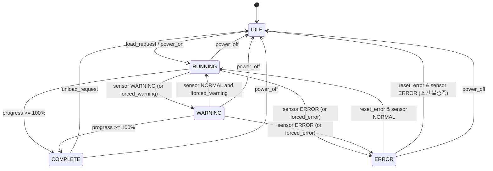

# 설비 시뮬레이터 상태머신 및 태그 설명

본 문서는 설비 시뮬레이터의 상태머신(`EquipmentState`) 동작 방식과 주요 태그 역할을 정리한다.  
구현 기준은 `state.py`의 `EquipmentState` 클래스를 따른다.

---

## 상태 정의

설비 상태는 정수 코드와 문자열 이름으로 정의된다.

| 코드 | 이름       | 설명                          |
|------|------------|-------------------------------|
| 0    | IDLE       | 대기 상태 (전원 ON, 작업 없음) |
| 1    | RUNNING    | 정상 가동 중                  |
| 2    | WARNING    | 경고 상태 (경고 센서 발생)   |
| 3    | ERROR      | 오류 상태 (에러 센서 발생)   |
| 4    | COMPLETE   | 사이클 완료                  |

상태명은 `ES.name()` 을 통해 로그에 함께 출력된다.

---

## 주요 태그 역할

### 공통 태그

- `power` (`role="power"`, bool)
  - 설비 전원 상태
  - `False` 가 되면 대부분의 태그가 초기화되고 상태는 `IDLE` 로 강제 전환된다.
- `status` (`role="status"`, int)
  - 설비의 현재 상태코드(ES.IDLE 등)를 나타낸다.
- `progress` (`role="progress"`, float, 0~100)
  - 현재 사이클 진행률 (%)
  - `RUNNING`/`WARNING` 상태에서 tick마다 증가한다.
- `cycle_time` (`role="cycle_time"`, float, 초 단위)
  - 예상 또는 최근 사이클 시간
  - 사이클 진행률과 경과 시간으로부터 추정되거나, 최근 사이클 완료 시간의 평균값으로 유지된다.
- `heartbeat` (`role="counter"`, int)
  - 시뮬레이터 tick마다 증가하는 카운터
- `part_count` (`role="counter"`, int)
  - `COMPLETE` 상태에 들어갈 때마다 1씩 증가 (생산 개수 카운트)

### 이벤트 태그

- `load_request` (`role="event"`)
  - `IDLE` → `RUNNING` 전환 트리거
- `unload_request` (`role="event"`)
  - `COMPLETE` → `IDLE` 전환 트리거
- `reset_error` (`role="event"`)
  - `WARNING` 또는 `ERROR` 상태에서 오류 복구 시도 트리거
- `inject_warning` (`role="event"`)
  - 경고 상태를 강제로 유도하는 테스트 이벤트
- `inject_error` (`role="event"`)
  - 오류 상태를 강제로 유도하는 테스트 이벤트

이벤트 태그는 `tick()` 내부에서 한 번 읽히면 자동으로 `False` 로 리셋된다(consume).

### 알람 태그

- `alarm_active` (`role="alarm"`, bool)
  - 알람 활성 여부
- `alarm_code` (`role="alarm"`, int)
  - 현재 알람 코드
  - 사용되는 코드 예:
    - `0` : `ALARM.NONE`
    - `100` : `ALARM.WARNING`
    - `200` : `ALARM.ERROR`
    - `110` : `ALARM.INJECT_WARNING`
    - `210` : `ALARM.INJECT_ERROR`

`alarm_active` 및 `alarm_code` 는 상태와 `inject_*` 이벤트에 따라 자동 갱신된다.

---

## 센서 임계값과 건강도 평가

### 임계값 구조

각 센서(`role="sensor"`) 는 다음 값들 중 일부 또는 전부를 가질 수 있다.

- `warn_lo`, `warn_hi` : 경고 구간 하한/상한
- `err_lo`,  `err_hi`  : 오류 구간 하한/상한

정상·경고·오류는 다음 규칙으로 판정된다.

- `ERROR`
  - 값 < `err_lo` 또는 값 > `err_hi`
- `WARNING`
  - `ERROR`가 아니면서,
  - 값 < `warn_lo` 또는 값 > `warn_hi`
- `RUNNING` (정상)
  - 위 두 조건에 모두 해당하지 않는 경우

각 tick에서 `_sensor_health()` 는 모든 센서를 검사하고 **가장 나쁜 상태**를 반환한다.

- 하나라도 `ERROR` → 전체 설비 `ERROR`
- `ERROR`는 없고, 하나라도 `WARNING` → 전체 설비 `WARNING`
- 그 외 → `RUNNING` (정상)

※ `warn_*`, `err_*` 가 하나도 없는 센서는 건강도 평가에서 무시된다.  
※ bool 센서(`result_ok` 등)는 임계값 없이 값 자체로 의미를 가진다(필요 시 별도 처리에서 활용).

---

## 상태 전이 규칙

### 기본 전이 요약

- `IDLE  --load_request=True-->  RUNNING`
- `RUNNING / WARNING  --progress=100%-->  COMPLETE`
- `RUNNING  --sensor ERROR-->  ERROR`
- `RUNNING  --sensor WARNING-->  WARNING`
- `WARNING  --sensor 정상-->  RUNNING` (자동 복귀, 강제 WARNING 플래그 없을 때)
- `WARNING  --sensor ERROR-->  ERROR`
- `ERROR / WARNING  --reset_error=True-->  RUNNING 또는 IDLE`
- `COMPLETE  --unload_request=True-->  IDLE`

### 각 상태별 상세 동작

#### IDLE

- 전원 ON이지만 작업은 시작하지 않은 상태
- 동작:
  - `cycle_time` 를 초기 추정값으로 설정
  - `load_request` 이벤트가 소비되면 `_enter_running(reset_progress=True)` 호출
    - `progress` 0으로 리셋
    - 사이클 시작 시간(`_cycle_start`) 기록
    - 상태를 `RUNNING` 으로 변경

#### RUNNING

- 정상 가동 중
- 동작:
  - 센서 건강도 = `ERROR` 인 경우 → `_enter_error()` 호출 → `ERROR`
  - 센서 건강도 = 정상(`RUNNING`) 이거나 경고 없음:
    - `progress` 를 `speed * dt` 만큼 증가
    - 진행률을 이용해 `cycle_time` 추정값 갱신
    - `progress >= 100` 이 되면 `_complete_cycle()` 호출 → `COMPLETE`
  - 센서 건강도 = `WARNING` 인 경우:
    - 상태를 `WARNING` 으로 변경
    - 알람 필드 갱신

#### WARNING

- 경고 상태(센서 경고 구간 진입)
- 동작:
  - 센서 건강도 = `ERROR` → `_enter_error()` → `ERROR`
  - 센서 건강도 = `RUNNING` 이고 강제 WARNING 플래그 없음:
    - 자동으로 `RUNNING` 으로 복귀
  - 그 외:
    - `RUNNING` 보다 감속된 속도(`speed * 0.6`)로 `progress` 증가
    - `progress >= 100` 이면 `_complete_cycle()` → `COMPLETE`

#### ERROR

- 오류 상태(센서 에러 구간 또는 강제 에러)
- 동작:
  - `cycle_time` 추정값 갱신만 수행 (진행률은 더 이상 증가하지 않음)
  - `reset_error` 이벤트가 들어오면 복구 루틴 실행:
    - 강제 플래그 제거 후 `_sensor_health()` 재평가
    - 여전히 `ERROR` 이면:
      - 상태를 `IDLE` 로 전환
      - `progress` 0으로 리셋
      - 런타임 사이클 타이머 리셋
      - `cycle_time` 를 초기 추정값으로 재설정
    - 그렇지 않으면:
      - `_resume_from_error()` 로 `RUNNING` 재개

#### COMPLETE

- 사이클 완료 상태
- 동작:
  - `part_count` 를 1 증가
  - `cycle_time` 에 이번 사이클 소요시간 기록
  - `alarm_*` 필드 갱신
  - `unload_request` 이벤트가 들어오면:
    - `progress` 0
    - 런타임 사이클 타이머 리셋
    - 상태를 `IDLE` 로 전환
    - `cycle_time` 를 초기 추정값으로 재설정

---

## 전원 OFF 처리

- `power == False` 인 경우:
  - `status` 를 `IDLE` 로 강제
  - `progress` 0, 각종 런타임 타이머 리셋
  - `status / progress / cycle_time / event / counter / alarm / sensor` 역할 태그는
    - bool → `False`
    - 숫자 → `0`
  - 강제 WARNING/ERROR 플래그 클리어
  - `alarm_active`, `alarm_code` 초기화

이후 다시 `power == True` 가 되어도 자동으로 `RUNNING` 은 되지 않고,  
`load_request` 이벤트로만 RUNNING 이 시작된다.

---

## 상태머신 Mermaid 다이어그램

---

## tick 처리 순서 개요

1. `power` 확인
   - OFF이면 상태/태그 초기화 후 반환
2. 현재 `status` 읽기
3. 센서/카운터 업데이트
   - 센서: RUNNING/ WARNING 에서만 노이즈 포함 값 갱신
   - `heartbeat` : tick마다 step만큼 증가
4. 이벤트 소비
   - `load_request`, `unload_request`, `reset_error`,
     `inject_warning`, `inject_error`
5. 강제 알람 플래그 반영
   - `inject_warning` → `forced_warning = True`
   - `inject_error`  → `forced_error = True`
6. 센서 건강도 평가 (`_sensor_health`)
   - 강제 플래그에 의해 ERROR/WARNING override 가능
7. 현재 상태별 전이 로직 수행
   - 위 “상태 전이 규칙” 참조
8. `alarm_active`, `alarm_code` 업데이트

---

## 활용 팁

- 테스트 시나리오
  - 정상 사이클:
    - `power=True` → `load_request=True` → `RUNNING` → `progress=100%` → `COMPLETE` → `unload_request=True` → `IDLE`
  - 경고/오류 주입:
    - `inject_warning=True` 또는 `inject_error=True` 로 상태머신과 알람 동작 확인
  - 오류 복구:
    - 의도적으로 센서 값을 `err_*` 범위 밖으로 작성해 `ERROR` 유발 후,
      `reset_error=True` 로 복구 흐름 검증
- `heartbeat` 와 `part_count` 를 이용해 설비 가동/생산 히스토리를 간단하게 추적 가능하다.